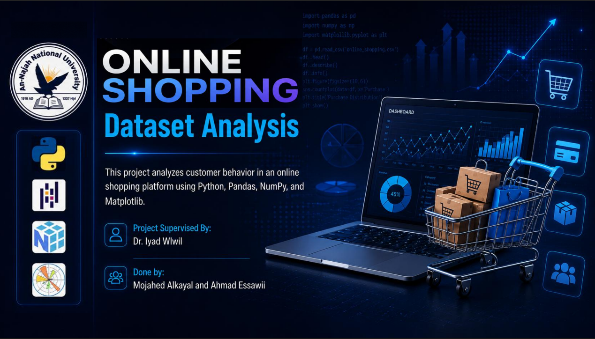

# 🛒 Online Shopping Customer Behavior Analysis


## 📌 Overview
This project analyzes online shopping customer data to uncover behavioral patterns and business insights.

**Goals:**
- Clean and prepare the dataset for analysis
- Handle missing values and invalid data
- Detect and treat outliers
- Explore customer behavior through statistics and visualizations
- Study relationships between variables
- Draw actionable business insights

---

## 🛠️ Tools & Libraries

| Library | Purpose |
|--------|---------|
| `Pandas` | Data manipulation and analysis |
| `NumPy` | Numerical computations |
| `Matplotlib` | Data visualization |

---

## 🗂️ Project Steps

### 1. 📦 Import Libraries
Load the Python libraries needed for data analysis and visualization.

### 2. 📂 Load the Dataset
Read the dataset into a Pandas DataFrame using `pd.read_csv()`.

### 3. 🔍 Explore the Data
Initial inspection of the dataset:
- Preview sample records
- Check data types and structure
- Generate summary statistics
- Check dataset dimensions

### 4. 🧹 Data Cleaning
Prepare the data for analysis:
- Standardize column names (CamelCase format)
- Fix incorrect data types
- Handle invalid entries using `pd.to_numeric(errors='coerce')`
- Remove duplicate records

### 5. 🩹 Handle Missing Values
Fill missing values using appropriate imputation:
- **Numeric columns** → filled with the **median**
- **Categorical columns** → filled with the **mode**

### 6. 📊 Outlier Detection & Treatment
Use box plots and the **IQR method** to identify and handle outliers in:
- `TimeOnSite`
- `PurchaseAmount`
- `ClickRate`

Outliers are replaced with the column median to preserve data integrity.

### 7. 📈 Data Visualization
Explore the data visually using:
- Histograms (distributions)
- Box plots (spread and outliers)
- Bar charts (categorical features)
- Scatter plots (relationships)

### 8. 🔬 Univariate & Bivariate Analysis
- Analyze individual variable distributions
- Compare variables against purchase amount
- Identify customer behavior patterns across gender, device, and discount usage

### 9. 🔗 Correlation Analysis
Compute and interpret correlations between numeric features to identify meaningful relationships.

### 10. 💡 Conclusions
Summarize key findings and business insights derived from the analysis.

---

## 📋 Results

- ✅ A fully cleaned and validated dataset
- 📊 Statistical summaries for all key features
- 🖼️ Visual insights across customer segments
- 🔗 Correlation analysis between variables
- 💼 Actionable customer behavior findings

---

## ▶️ How to Run

1. Clone or download the project files
2. Install the required libraries:
   ```bash
   pip install pandas numpy matplotlib
   ```
3. Open `main.ipynb` in Jupyter Notebook or JupyterLab
4. Run all cells from top to bottom
5. Review the visualizations and conclusions at the end

---

## 👨‍💻 Authors

**Ahmad Essawii** &emsp;|&emsp; **Mojahed Alkayyal**
